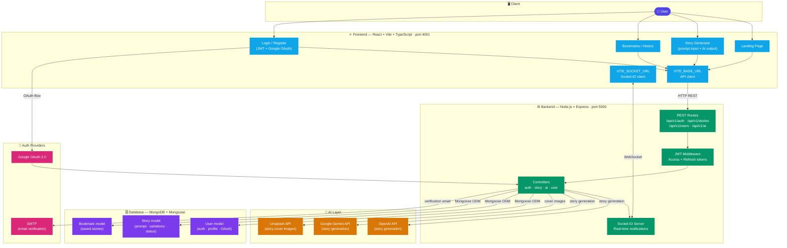

# 🏗️ StorySparkAI – Architecture Overview

This document explains how StorySparkAI's components fit together. It's written for new contributors who want to understand the system before diving into the code.

---

## 🗺️ System Architecture Diagram



---

## 🧱 Layer-by-Layer Breakdown

### 1. ⚛️ Frontend — `frontend/`
React + Vite + TypeScript SPA running on port **4001**.

- **`VITE_BASE_URL`** — points to the backend REST API (`http://localhost:5000/api/v1`)
- **`VITE_SOCKET_URL`** — points to the Socket.IO server for real-time notifications
- **`VITE_GOOGLE_CLIENT_ID`** — used for Google OAuth login on the client side

Key pages:
| Page | Purpose |
|---|---|
| Landing | Introduction and entry point |
| Story Generator | Prompt input, AI story output, multiple variations |
| Bookmarks / History | Saved and previously generated stories |
| Login / Register | JWT auth + Google OAuth |

---

### 2. ⚙️ Backend — `backend/`
Node.js + Express REST API running on port **5000** (configurable via `PORT`).

**Request lifecycle:**
```
REST Route → JWT Middleware → Controller → DB / AI / Socket.IO
```

Key route groups:

| Route prefix | Handles |
|---|---|
| `/api/v1/auth` | Register, login, refresh token, Google OAuth, email verify |
| `/api/v1/stories` | Create, read, bookmark, delete stories |
| `/api/v1/ai` | AI generation, analysis, critique |
| `/api/v1/users` | User profile management |

---

### 3. 🔐 Auth & Security
Two-token JWT strategy:

| Token | Env var | Purpose |
|---|---|---|
| Access token | `JWT_SECRET` + `JWT_EXPIRES_IN` | Short-lived API access |
| Refresh token | `JWT_REFRESH_SECRET` + `JWT_REFRESH_EXPIRES_IN` | Long-lived session renewal |

Password hashing uses **bcrypt** (`SALT_ROUNDS`). Google OAuth is handled via `GOOGLE_CLIENT_ID` on both frontend and backend. Email verification uses SMTP (`VERIFY_EMAIL` + `VERIFY_PASSWORD`).

---

### 4. 🤖 AI Layer
StorySparkAI supports two AI providers — switchable via environment variables:

| Provider | Env var | Used for |
|---|---|---|
| OpenAI | `OPEN_AI_KEY` | Story generation + analysis |
| Google Gemini | `GEMINI_API_KEY` | Story generation + analysis |
| Unsplash | `UNSPLASH_KEY_API` | Story cover image fetching |

AI is used **only** for generation and analysis — all story data, user data, and bookmarks are stored in MongoDB.

---

### 5. 🗄️ Database — MongoDB + Mongoose — `backend/`

| Model | Stores |
|---|---|
| `User` | Email, hashed password, Google OAuth ID, roles, verification status |
| `Story` | Prompt, AI-generated variations, cover image, author reference |
| `Bookmark` | User–Story reference for saved stories |

---

### 6. 🔔 Real-Time — Socket.IO
The backend runs a Socket.IO server for real-time notifications (story generation updates, etc.).

- Frontend connects via `VITE_SOCKET_URL` using the logged-in user's access token
- **Do not** point `VITE_SOCKET_URL` at Vercel — serverless functions cannot maintain persistent WebSocket connections

---

## 📂 Key Files for New Contributors

| What you're working on | Start here |
|---|---|
| Adding a new API endpoint | `backend/src/routes/` → `backend/src/controllers/` |
| Changing auth logic | `backend/src/middleware/` (JWT) |
| Modifying DB schema | `backend/src/models/` |
| Switching AI provider | `backend/src/controllers/ai*` + `.env` keys |
| Frontend UI changes | `frontend/src/` pages and components |
| Real-time notifications | Socket.IO setup in `backend/src/` + `VITE_SOCKET_URL` |
| Environment config | `backend/.env.example` · `frontend/.env.example` |

---

## ⚙️ Local Setup (Quick Reference)

```bash
# 1. Clone and install (npm workspaces — single install)
git clone https://github.com/<your-username>/story-spark-ai.git
cd story-spark-ai
npm install

# 2. Set up environment files
cp backend/.env.example backend/.env
cp frontend/.env.example frontend/.env
# Fill in DATABASE_URL, JWT secrets, AI keys, VITE_BASE_URL

# 3. Run both frontend and backend
npm run dev
# Frontend → http://localhost:4001
# Backend  → http://localhost:5000
```

---

## 🌐 Deployment (Vercel)

Two separate Vercel projects from the same monorepo:

| Project | Root directory |
|---|---|
| Frontend | `frontend/` |
| Backend API | `backend/` |

> Socket.IO **cannot** run on Vercel serverless. Use a persistent host (e.g. Render) for `VITE_SOCKET_URL`.

---

> **Core rule while contributing:**
> The AI layer is **advisory and generative only** — it never stores data directly.
> All persistence goes through the Express controllers → Mongoose → MongoDB.
